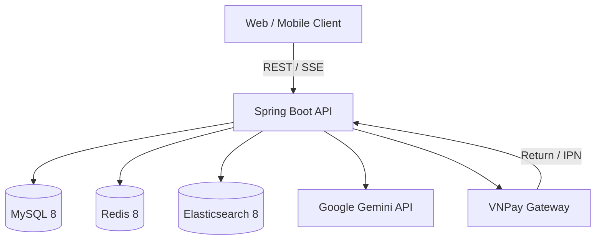
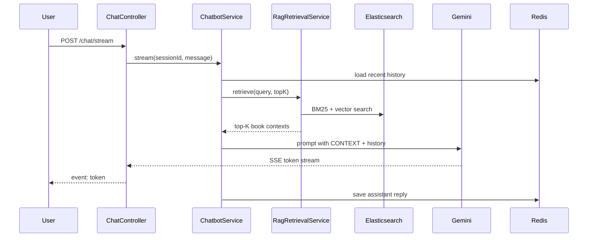
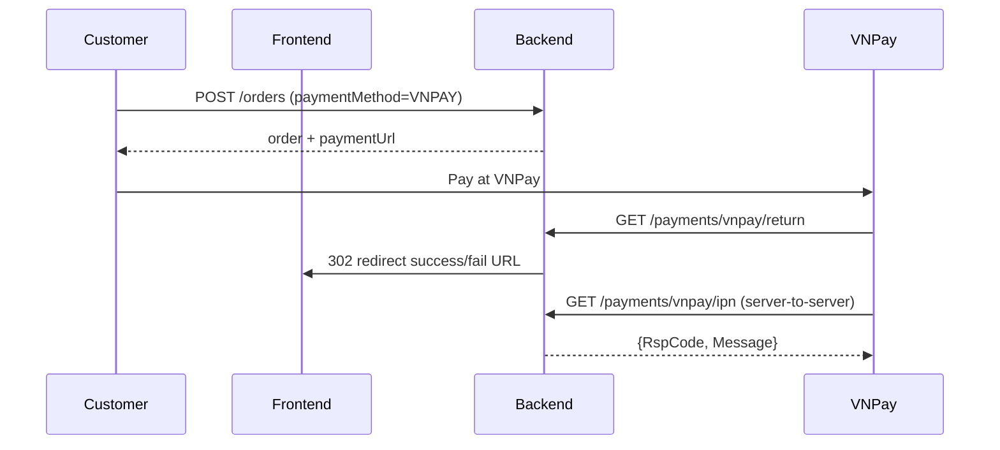

# BookVerse Backend

REST API backend for **BookVerse** — an online bookstore platform. The application provides catalog management, shopping cart & checkout, role-based access control, full-text product search (Elasticsearch), VNPay online payments, and an AI book assistant powered by RAG + Google Gemini.

**Base URL:** `http://localhost:8080/api/v1`  
**Default port:** `8080`

---

## Table of Contents

- [Features](#features)
- [Architecture](#architecture)
- [Tech Stack](#tech-stack)
- [Project Structure](#project-structure)
- [Database Schema](#database-schema)
- [Prerequisites](#prerequisites)
- [Getting Started](#getting-started)
- [Environment Variables](#environment-variables)
- [Authentication & Authorization](#authentication--authorization)
- [API Reference](#api-reference)
- [Response Format](#response-format)
- [Search (Elasticsearch)](#search-elasticsearch)
- [AI Chatbot (RAG)](#ai-chatbot-rag)
- [Payments (VNPay)](#payments-vnpay)
- [Order Lifecycle](#order-lifecycle)
- [File Upload & Static Assets](#file-upload--static-assets)
- [Caching (Redis)](#caching-redis)
- [Error Handling](#error-handling)
- [Development](#development)
- [Docker](#docker)

---

## Features

| Module | Description |
|---|---|
| **Catalog** | CRUD for books, authors, categories, publishers, suppliers; book images; stock & discount management |
| **Auth** | Register, login, JWT access token, HttpOnly refresh cookie, logout |
| **RBAC** | Roles (`ADMIN`, `MANAGER`, `STAFF`, `CUSTOMER`) with fine-grained permissions |
| **Cart** | Add / increase / decrease / remove items; one cart per customer |
| **Orders** | Create from cart or line items; COD & VNPay; status workflow; admin search & filters |
| **Payments** | VNPay payment URL generation, browser return redirect, server-to-server IPN |
| **Search** | Public autocomplete + faceted product search via Elasticsearch |
| **Dashboard** | Revenue, orders, AOV, cancel rate, status breakdown, top books (admin only) |
| **AI Assistant** | SSE streaming chat; hybrid BM25 + vector RAG; conversation memory in Redis |
| **Files** | Single & batch upload; served publicly under `/storage/**` |

---

## Architecture



**Request flow (typical authenticated call):**

1. Client sends `Authorization: Bearer <access_token>`.
2. Spring Security validates JWT (HS256) and loads permissions from the `permissions` claim.
3. `@PreAuthorize` checks authority on protected endpoints.
4. Controller delegates to service → repository (JPA / Querydsl).
5. `FormatResponse` advice wraps successful 2xx bodies in `RestResponse`.

---

## Tech Stack

| Layer | Technology |
|---|---|
| Runtime | Java 21 |
| Framework | Spring Boot 3.4.x |
| Persistence | Spring Data JPA, Hibernate (`ddl-auto: update`) |
| Dynamic queries | Querydsl 5 |
| Database | MySQL 8 |
| Cache / chat memory | Redis 8 |
| Search & vectors | Elasticsearch 8.13 |
| Security | Spring Security, OAuth2 Resource Server, JWT HS256, BCrypt |
| AI | LangChain4j 1.13 + Google Gemini (`gemini-2.5-flash`, `gemini-embedding-001`) |
| Payments | VNPay |
| DTO mapping | ModelMapper |
| API docs | SpringDoc OpenAPI 2.5 |
| Env loading | spring-dotenv |
| Build | Maven 3.9+ |

---

## Project Structure

```
src/main/java/com/example/bookverse/
├── BookverseApplication.java
├── controller/              # REST endpoints (@RequestMapping("/api/v1"))
├── service/                 # Business interfaces
├── service/impl/            # @Service implementations
├── repository/              # JpaRepository + QuerydslPredicateExecutor
├── domain/                  # JPA entities
├── elasticsearch/           # BookDocument (ES index model)
├── dto/
│   ├── request/             # Req* — validated with @Valid
│   ├── response/            # Res*, RestResponse, ResPagination
│   ├── criteria/            # CriteriaFilter* — query params + Pageable
│   ├── enums/               # OrderStatus, PaymentMethod, SortType, …
│   └── record/              # Immutable DTOs (chat, search hits)
├── config/                  # Security, JWT, CORS, Redis, ES indexer, …
├── exception/               # GlobalException + domain exceptions
└── util/                    # SecurityUtil, FormatResponse, VnpayUtil, …

src/main/resources/
└── application.yml          # Spring + bookverse.* + langchain4j.* config

init/
└── bookverse.sql            # Sample data (mounted into MySQL on first Docker start)
```

---

## Database Schema

```
roles ──< users ──── customers ──── carts ──< cart_details ──> books
 │                    │
 └── permission_role  └──< orders ──< order_details ──> books
 │                              │
 permissions                    order_payments
                     categories ──< books ──< book_images
                     publishers ──< books
                     suppliers  ──< books
                     authors  >── author_book ──< books
```

- Hibernate manages schema migrations via `spring.jpa.hibernate.ddl-auto=update`.
- `DatabaseInitializer` seeds permissions, roles, and default users when tables are empty.
- `init/bookverse.sql` provides sample books, authors, categories, etc. when MySQL starts via Docker Compose.

---

## Prerequisites

| Requirement | Version / Notes |
|---|---|
| JDK | 21 |
| Maven | 3.9+ (or use `./mvnw`) |
| MySQL | 8.x — port `3306`, database `bookverse` |
| Redis | 8.x — port `6379`, password required |
| Elasticsearch | 8.x — port `9200`, security disabled for local dev |
| Docker (optional) | Docker Compose for full stack |
| Gemini API key | Required for chatbot & book embeddings |

---

## Getting Started

### 1. Clone and configure environment

```bash
cp .env.example .env
# Edit .env with your values (see Environment Variables below)
```

> OS environment variables take precedence over `.env` file values (spring-dotenv).

### 2. Start infrastructure

**Option A — Docker (recommended for infra only):**

```bash
docker compose up -d mysql-db redis elasticsearch
```

**Option B — Local installs** of MySQL, Redis, and Elasticsearch on the default ports.

### 3. Run the application

```bash
# Linux / macOS
./mvnw spring-boot:run

# Windows
.\mvnw.cmd spring-boot:run
```

On startup:

- Hibernate syncs the MySQL schema.
- `DatabaseInitializer` creates RBAC data and seed users (if empty).
- `BookSearchIndexer` re-indexes all books into Elasticsearch with embeddings.

### 4. Verify

| Resource | URL |
|---|---|
| API base | http://localhost:8080/api/v1 |
| Swagger UI | http://localhost:8080/swagger-ui.html |
| OpenAPI JSON | http://localhost:8080/v3/api-docs |
| Actuator | http://localhost:8080/actuator (if exposed) |
| Static files | http://localhost:8080/storage/{filename} |

---

## Environment Variables

Copy `.env.example` to `.env` and fill in all required values.

| Variable | Required | Description |
|---|---|---|
| `MYSQL_URL` | Yes | JDBC URL, e.g. `jdbc:mysql://localhost:3306/bookverse` |
| `MYSQL_USERNAME` | Yes | MySQL username |
| `MYSQL_PASSWORD` | Yes | MySQL password |
| `MYSQL_ROOT_PASSWORD` | Docker | Root password for MySQL container |
| `MYSQL_DATABASE` | Docker | Database name (`bookverse`) |
| `REDIS_PASSWORD` | Yes | Redis auth password (shared by app & Docker) |
| `BOOKVERSE_JWT_BASE64_SECRET` | Yes | Base64-encoded secret for JWT HS256 signing |
| `BOOKVERSE_JWT_ACCESS_TOKEN_VALIDITY` | No | Access token TTL in seconds (default: `100000`) |
| `BOOKVERSE_JWT_REFRESH_TOKEN_VALIDITY` | No | Refresh token TTL in seconds (default: `864000`) |
| `BOOKVERSE_UPLOAD_BASE_URI` | Yes | File storage URI, e.g. `file:///D:/upload_bookverse/` |
| `BOOKVERSE_VNPAY_TMN_CODE` | VNPay | Merchant terminal code |
| `BOOKVERSE_VNPAY_HASH_SECRET` | VNPay | VNPay HMAC secret |
| `BOOKVERSE_VNPAY_PAYMENT_URL` | VNPay | Payment gateway URL (sandbox or production) |
| `BOOKVERSE_VNPAY_RETURN_URL` | VNPay | Backend return URL, e.g. `http://localhost:8080/api/v1/payments/vnpay/return` |
| `BOOKVERSE_VNPAY_FRONTEND_SUCCESS_URL` | VNPay | Frontend redirect on success |
| `BOOKVERSE_VNPAY_FRONTEND_FAIL_URL` | VNPay | Frontend redirect on failure |
| `GEMINI_API_KEY` | Chatbot | Google Gemini API key |
| `BOOKVERSE_CHATBOT_MAX_MEMORY_MESSAGES` | No | Max messages kept per chat session |
| `BOOKVERSE_CHATBOT_TOP_K` | No | Number of RAG context chunks (default: `3`) |
| `BOOKVERSE_CHATBOT_MEMORY_TTL_MINUTES` | No | Redis TTL for chat history |

---

## Authentication & Authorization

### JWT flow

| Step | Behavior |
|---|---|
| **Login** | `POST /auth/login` → returns `accessToken` in body + `refresh_token` in HttpOnly cookie |
| **Refresh** | `GET /auth/refresh` → reads `refresh_token` cookie, rotates both tokens |
| **Authenticated calls** | Header: `Authorization: Bearer <access_token>` |
| **Logout** | `POST /auth/logout` → clears refresh token in DB and expires cookie |

Permissions are embedded in the JWT under the `permissions` claim and mapped to Spring authorities (no prefix).

### Roles & permissions

| Role | Scope |
|---|---|
| **ADMIN** | Full access (all permissions, including dashboard) |
| **MANAGER** | Product catalog CRUD, view orders/customers, file upload |
| **STAFF** | View catalog, manage customers & orders, file upload |
| **CUSTOMER** | Cart, create/view own orders, cancel own orders |

Permission naming convention: `ENTITY_ACTION` (e.g. `BOOK_CREATE`, `ORDER_VIEW_MINE`).

### Public endpoints (no JWT)

| Pattern | Methods |
|---|---|
| `/auth/login`, `/auth/register`, `/auth/refresh` | POST / GET |
| `/books/**` | GET |
| `/categories`, `/publishers`, `/suppliers` | GET |
| `/search/**` | GET |
| `/chat/**` | GET, POST |
| `/payments/vnpay/return`, `/payments/vnpay/ipn` | GET |
| `/storage/**` | GET |

All other endpoints require authentication and the appropriate authority.

### Default seed accounts

Created by `DatabaseInitializer` when the `users` table is empty.  
**Default password for all accounts: `123456`**

| Role | Email |
|---|---|
| Admin | `admin@bookverse.com` |
| Manager | `manager1@bookverse.com`, `manager2@bookverse.com` |
| Staff | `staff1@bookverse.com` … `staff5@bookverse.com` |
| Customer | `customer1@bookverse.com` … `customer10@bookverse.com` |

Each customer account is linked to a `customers` record and an empty cart.

### CORS

Allowed origins (development):

- `http://localhost:3000`
- `http://localhost:4173`
- `http://localhost:5173`
- `http://localhost:4175`

Credentials (cookies) are enabled.

---

## API Reference

### Auth

| Method | Path | Auth | Description |
|---|---|---|---|
| POST | `/auth/login` | Public | Login with email & password |
| POST | `/auth/register` | Public | Register new customer account |
| GET | `/auth/refresh` | Cookie | Refresh access token |
| GET | `/auth/me` | JWT | Current user profile |
| POST | `/auth/logout` | JWT | Invalidate refresh token |

**Login request:**

```json
{
  "email": "customer1@bookverse.com",
  "password": "123456"
}
```

---

### Books

| Method | Path | Permission | Description |
|---|---|---|---|
| POST | `/books` | `BOOK_CREATE` | Create book (syncs to Elasticsearch) |
| PUT | `/books` | `BOOK_UPDATE` | Update book |
| GET | `/books/{id}` | Public | Get book by ID |
| GET | `/books` | `BOOK_VIEW_ALL` | List all books |
| GET | `/books/top-5-latest` | Public | Latest 5 books |
| GET | `/books/search` | `BOOK_VIEW_ALL_WITH_PAGINATION_AND_FILTER` | Admin search with Querydsl filters |
| DELETE | `/books/{id}` | `BOOK_DELETE` | Delete book |

---

### Authors, Categories, Publishers, Suppliers

Each resource follows the same CRUD pattern:

| Method | Path pattern | Typical permission |
|---|---|---|
| POST | `/{resource}` | `{ENTITY}_CREATE` |
| PUT | `/{resource}` | `{ENTITY}_UPDATE` |
| GET | `/{resource}/{id}` | Public or `{ENTITY}_VIEW_BY_ID` |
| GET | `/{resource}` | Public (categories, publishers, suppliers) or `{ENTITY}_VIEW_ALL` |
| GET | `/{resource}/search` | `{ENTITY}_VIEW_ALL_WITH_PAGINATION_AND_FILTER` |
| DELETE | `/{resource}/{id}` | `{ENTITY}_DELETE` |

Resources: `authors`, `categories`, `publishers`, `suppliers`.

---

### Search (public)

| Method | Path | Query params | Description |
|---|---|---|---|
| GET | `/search/autocomplete` | `query` | Title/author/category suggestions |
| GET | `/search/products` | See below | Faceted product search + pagination |

**`CriteriaFilterProduct` query parameters:**

| Param | Type | Description |
|---|---|---|
| `title` | string | Full-text search (uses Elasticsearch when set) |
| `categoryId` | list | Filter by category IDs |
| `publisherId` | list | Filter by publisher IDs |
| `publishYear` | list | Filter by publish year |
| `coverFormat` | list | `HARDCOVER`, `PAPERBACK`, … |
| `minPrice` / `maxPrice` | double | Price range |
| `sortType` | enum | `NEWEST`, `SOLD_MOST`, `PRICE_LOW_TO_HIGH`, `PRICE_HIGH_TO_LOW` |
| `page` / `size` | int | Pagination (1-indexed page) |

---

### Cart

| Method | Path | Permission | Description |
|---|---|---|---|
| POST | `/carts/items` | `CART_ADD_TO_CART` | Add book to cart |
| GET | `/carts` | `CART_VIEW_BY_ID` | Get current customer's cart |
| PUT | `/carts/items/{id}/increase` | `CART_ADD_TO_CART` | Increase item quantity |
| PUT | `/carts/items/{id}/decrease` | `CART_ADD_TO_CART` | Decrease item quantity |
| DELETE | `/carts/items/{id}` | `CART_ADD_TO_CART` | Remove item from cart |

---

### Orders

| Method | Path | Permission | Description |
|---|---|---|---|
| POST | `/orders` | `ORDER_CREATE` | Place order (from cart lines or explicit items) |
| PUT | `/orders` | `ORDER_UPDATE` | Update order (status, etc.) |
| GET | `/orders/{id}` | `ORDER_VIEW_BY_ID` | Order detail |
| GET | `/orders/me` | `ORDER_VIEW_MINE` | Current customer's orders (paginated) |
| GET | `/orders/search` | `ORDER_VIEW_ALL_WITH_PAGINATION_AND_FILTER` | Admin order search |
| DELETE | `/orders/{id}` | `ORDER_CANCEL` | Cancel order (sets status to `CANCELLED`) |

**Create order request (simplified):**

```json
{
  "receiverName": "Nguyen Van A",
  "receiverAddress": "123 Street, HCMC",
  "receiverPhone": "0900000001",
  "receiverEmail": "customer1@bookverse.com",
  "paymentMethod": "VNPAY",
  "note": "Deliver after 5 PM",
  "items": [
    { "bookId": 1, "quantity": 2 }
  ]
}
```

For `VNPAY`, the response includes a `paymentUrl` to redirect the customer.  
The cart is cleared after a successful order creation.

---

### Users, Customers, Roles, Permissions

| Resource | Endpoints | Notes |
|---|---|---|
| Users | `/users`, `/users/{id}`, `/users/search` | Staff/admin user management |
| Customers | `/customers`, `/customers/{id}`, `/customers/search` | Customer profiles with loyalty level |
| Roles | `/roles`, `/roles/{id}`, `/roles/search` | Role CRUD + permission assignment |
| Permissions | `/permissions`, `/permissions/{id}`, `/permissions/search` | Permission CRUD |

---

### Dashboard

| Method | Path | Permission | Description |
|---|---|---|---|
| GET | `/dashboard/overview` | `DASHBOARD_VIEW` | Admin analytics overview |

**Query parameters (`CriteriaFilterDashboard`):**

| Param | Description |
|---|---|
| `fromDate` / `toDate` | Date range (ISO date, default: last 30 days) |
| `groupBy` | Time grouping for charts (`day`, `week`, `month`) |
| `topN` | Top-selling books count (default 5, max 20) |

Returns: revenue, total orders, new customers, products sold, AOV, cancel rate, status breakdown, revenue trend, top books.

---

### Files

| Method | Path | Permission | Description |
|---|---|---|---|
| POST | `/files` | `FILE_UPLOAD` | Upload single file (`file`, `folder`) |
| POST | `/files/batch` | `FILE_UPLOAD` | Upload multiple files |

Max upload size: **50 MB** per file/request.

---

### Chat (public)

| Method | Path | Description |
|---|---|---|
| GET | `/chat/history?sessionId=` | Retrieve conversation history from Redis |
| POST | `/chat/stream` | SSE streaming AI response |

**Stream request:**

```json
{
  "sessionId": "uuid-or-any-session-key",
  "message": "Recommend a Vietnamese novel under 200k"
}
```

**SSE events:** named `token`, each event carries a partial text chunk. Connection timeout: 120 seconds.

---

## Response Format

All **2xx** responses are automatically wrapped by `FormatResponse`:

```json
{
  "statusCode": 200,
  "message": "Call API SUCCESSFULLY",
  "error": null,
  "data": { }
}
```

**Paginated responses** (`ResPagination`):

```json
{
  "meta": {
    "page": 1,
    "pageSize": 10,
    "pages": 5,
    "total": 50
  },
  "result": [ ]
}
```

Pagination is **one-indexed** (`spring.data.web.pageable.one-indexed-parameters: true`).

**Error responses** (4xx) from `GlobalException`:

```json
{
  "statusCode": 400,
  "message": "Human-readable error detail",
  "error": "Error category"
}
```

| HTTP Status | Typical cause |
|---|---|
| 401 | Missing, expired, or invalid JWT |
| 403 | Valid JWT but insufficient permission |
| 400 | Validation error, invalid ID, business rule violation |

---

## Search (Elasticsearch)

### Index: `books`

Each book is stored as a `BookDocument` with:

- Text fields: `title`, `authors`, `category`, `description`, `publisher`, `supplier`, `ragContent`
- Filters: `categoryId`, `publisherId`, `publisherYear`, `price`, `coverFormat`, `quantity`, `sold`
- Vector field: `embedding` (Gemini embeddings of `ragContent`)
- Suggest field: `suggest` (completion for autocomplete)

### Indexing

- **On startup:** `BookSearchIndexer` loads all books from MySQL, generates embeddings, and bulk-saves to ES.
- **On CRUD:** `BookServiceImpl` updates the ES document when books are created, updated, or deleted.

### Search modes

| Endpoint | Strategy |
|---|---|
| `/search/autocomplete` | Elasticsearch completion suggester |
| `/search/products` | BM25 multi-match + ES filters; falls back to JPA/Querydsl when no `title` query |
| Chatbot RAG | Hybrid BM25 + kNN vector search, merged with Reciprocal Rank Fusion (RRF, k=60) |

---

## AI Chatbot (RAG)



**Behavior:**

- Uses **Google Gemini 2.5 Flash** for streaming generation.
- Retrieves book context via **hybrid search** (keyword + semantic) from Elasticsearch.
- Stores conversation in **Redis** with configurable TTL and message limit.
- Strict prompt rules: answer only from provided context; refuse out-of-scope questions in Vietnamese.

**Required env:** `GEMINI_API_KEY`, running Elasticsearch with indexed books.

---

## Payments (VNPay)



| Step | Detail |
|---|---|
| Order creation | Stock is **not** deducted until payment succeeds |
| Payment record | `OrderPayment` created with status `INITIATED` |
| Return URL | Browser redirect → backend verifies signature → redirects to frontend |
| IPN | Server-to-server confirmation; updates payment & order status, deducts stock |

Configure all `BOOKVERSE_VNPAY_*` variables for sandbox or production.

---

## Order Lifecycle

### Statuses (`OrderStatus`)

| Status | Meaning |
|---|---|
| `PENDING` | New order, awaiting confirmation / payment |
| `CONFIRMED` | Order confirmed |
| `SHIPPING` | Out for delivery |
| `DELIVERED` | Completed |
| `CANCELLED` | Cancelled (soft delete via status update) |

### Payment methods (`PaymentMethod`)

| Method | Stock deduction | Payment flow |
|---|---|---|
| `COD` | Immediate on order creation | Pay on delivery |
| `VNPAY` | On successful IPN/return verification | Online payment URL |

### Customer levels (`CustomerLevel`)

`BRONZE` → `SILVER` → `GOLD` → `DIAMOND` (loyalty tiers based on spending).

---

## File Upload & Static Assets

1. Upload via `POST /api/v1/files` with `multipart/form-data` (`file`, `folder`).
2. Files are stored under the directory configured in `BOOKVERSE_UPLOAD_BASE_URI`.
3. Public access: `GET /storage/{filename}` (no authentication).

Example upload URI (Windows):

```
BOOKVERSE_UPLOAD_BASE_URI=file:///D:/upload_bookverse/
```

---

## Caching (Redis)

Spring Cache backed by Redis for reference data:

| Cache name | TTL |
|---|---|
| `category`, `author`, `publisher`, `supplier` | 1 hour |
| `role`, `permission` | 24 hours |
| Default | 30 minutes |

Chat conversation history is also stored in Redis (separate from Spring Cache).

---

## Error Handling

| Exception | HTTP | When |
|---|---|---|
| `IdInvalidException` | 400 | Invalid/missing ID, insufficient stock, unauthorized resource access |
| `ExistDataException` | 400 | Duplicate data (email, etc.) |
| `InvalidEmailOrPassword` | 400 | Login failure |
| `MethodArgumentNotValidException` | 400 | `@Valid` validation errors |
| Spring Security | 401 / 403 | Auth / authorization failures |

Security error messages are in Vietnamese for user-facing clarity.

---

## Development

### Build & test

```bash
./mvnw clean package      # Build JAR
./mvnw test               # Run tests
./mvnw spring-boot:run    # Dev server with DevTools restart
```

### Code conventions

- **Constructor injection only** — never `@Autowired` on fields.
- **Lombok** on all entities and DTOs.
- **Interfaces** in `service/`, implementations in `service/impl/`.
- **`@Transactional`** on service write methods.
- **Querydsl** (`JPAQueryFactory`, `BooleanBuilder`) for dynamic filters in `CriteriaFilter*`.
- **Permissions:** `@PreAuthorize("hasAuthority('ENTITY_ACTION')")`.
- Controllers stay thin — all business logic in services.

### Querydsl code generation

Querydsl Q-classes are generated at compile time via the Maven compiler annotation processor. Run `./mvnw compile` after entity changes.

---

## Docker

Run the full stack (app + MySQL + Redis + Elasticsearch):

```bash
docker compose up -d --build
```

| Service | Container | Port |
|---|---|---|
| Spring Boot app | `bookverse-app` | 8080 |
| MySQL 8 | `mysql` | 3306 |
| Redis 8 | `redis` | 6379 |
| Elasticsearch 8.13 | `elasticsearch` | 9200 |

**Notes:**

- MySQL mounts `./init/` for initial SQL seed data and `./mysql_data/` for persistence.
- Elasticsearch runs single-node with security disabled (development only).
- The app container reads env vars from `.env` via Docker Compose interpolation.

**Infra only (run app locally):**

```bash
docker compose up -d mysql-db redis elasticsearch
./mvnw spring-boot:run
```

---

## License

Internal / educational project — no public license declared.
